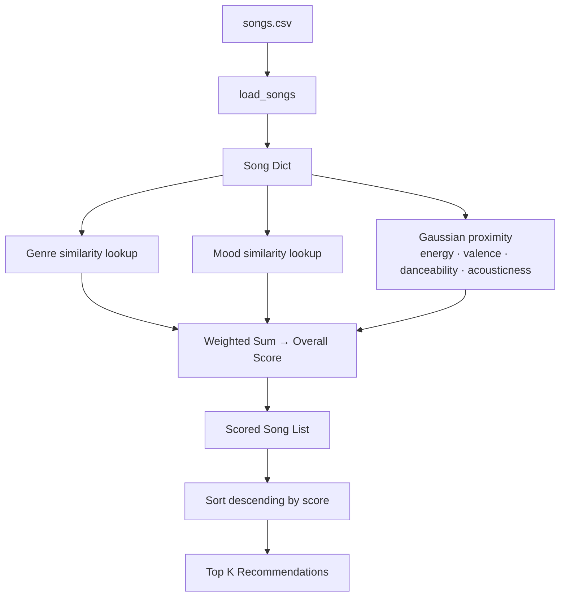
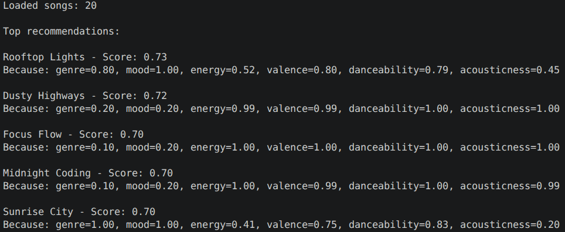

# 🎵 Music Recommender Simulation

## Project Summary

In this project you will build and explain a small music recommender system.

Your goal is to:

- Represent songs and a user "taste profile" as data
- Design a scoring rule that turns that data into recommendations
- Evaluate what your system gets right and wrong
- Reflect on how this mirrors real world AI recommenders

Replace this paragraph with your own summary of what your version does.

---

## How The System Works

- How does your `Recommender` compute a score for each song
- How do you choose which songs to recommend

You can include a simple diagram or bullet list if helpful.

My system will, based on real-world systems like YouTube and Spotify, prioritize a content-based filtering approach to recommend songs based on the user's preferences for certain features of the songs. A collaboration filtering aproach, which would recommend songs based on the preferences of similar users, is not viable for this project due to the lack of user data.

Each song uses
- Genre: the category of music (e.g., pop, rock, jazz)
- Mood: the mood category of the music (e.g. chill, intense, romantic)
- Energy: how energetic the song is (0 to 1)
- Valence: how positive or happy the song is (0 to 1)
- Danceability: how suitable the song is for dancing (0 to 1)
- Acousticness: how acoustic the song is (0 to 1)

The UserProfile stores the user's preferences for each of these features. For quantitative features they are on a scale from 0 to 1. For qualitative features there is a single favorite associated with the user for genre and mood. 

Quantitative preferences will be inputted by the user when they create their profile on a scale of 1-10, which will then be converted to a scale of 0-1 for the scoring function. Qualitative preferences will be printed and accepted as string inputs.

The Recommender computes a score for each song based on the weighted-sum proximity of the song's features to the user's preferences. The closer the song is to the user's preferences, the higher the score. This is done using a Gaussian proximity function for quantitative features, and a binary similarity matrix for qualitative features.

Each feature is assigned a set weight:
- genre=0.15
- mood=0.20
- energy=0.20
- valence=0.15
- danceability=0.15
- accousticness=0.15

Each score is multiplied by the weight and they're added up for the final score (hence weighted-sum).

The songs with the highest scores are then recommended to the user in descending order.

Application dataflow: 
1. Input (user preferences) 
2. Process (The Loop: Judging every individual song in the CSV using scoring logic) 
3. Output (The Ranking: Top K Recommendations)



#### Pop Happy Main Output


#### Main Output for list of profiles

In order:
profiles = [
    pop_happy,
    energetic_pop,
    chill_lofi,
    deep_intense_rock,
    undecided_listener,
    classical_intense,
    all_maximums,
    all_minimums,
    high_energy_melancholic,
    low_energy_celebratory
]

pop_happy = {
    "genre": "pop",
    "mood": "happy",
    "energy": 0.70,
    "valence": 0.90,
    "danceability": 0.80,
    "acousticness": 0.50
}

energetic_pop = {
    "genre": "pop",
    "mood": "intense",
    "energy": 1.00,
    "valence": 0.50,
    "danceability": 0.80,
    "acousticness": 0.50
}

chill_lofi = {
    "genre": "lofi",
    "mood": "chill",
    "energy": 0.20,
    "valence": 0.50,
    "danceability": 0.20,
    "acousticness": 0.50
}

deep_intense_rock = {
    "genre": "rock",
    "mood": "intense",
    "energy": 1.00,
    "valence": 0.50,
    "danceability": 0.80,
    "acousticness": 0.50
}

undecided_listener = {
    "genre": "pop",
    "mood": "relaxed",
    "energy": 0.5,
    "valence": 0.5,
    "danceability": 0.5,
    "acousticness": 0.5
}

classical_intense = {
    "genre": "classical",
    "mood": "intense",
    "energy": 0.9,
    "valence": 0.4,
    "danceability": 0.2,
    "acousticness": 0.95
}

all_maximums = {
    "genre": "hip hop",
    "mood": "spirited",
    "energy": 1.0,
    "valence": 1.0,
    "danceability": 1.0,
    "acousticness": 0.0
}

all_minimums = {
    "genre": "classical",
    "mood": "yearning",
    "energy": 0.0,
    "valence": 0.0,
    "danceability": 0.0,
    "acousticness": 1.0
}

high_energy_melancholic = {
    "genre": "metal",
    "mood": "melancholic",
    "energy": 0.95,
    "valence": 0.1,
    "danceability": 0.8,
    "acousticness": 0.02
}

low_energy_celebratory = {
    "genre": "ambient",
    "mood": "celebratory",
    "energy": 0.1,
    "valence": 0.95,
    "danceability": 0.05,
    "acousticness": 0.95
}

Top recommendations:

Rooftop Lights - Score: 0.94
Because: genre=0.80, mood=1.00, energy=0.98, valence=0.96, danceability=1.00, acousticness=0.89

Sunrise City - Score: 0.92
Because: genre=1.00, mood=1.00, energy=0.93, valence=0.98, danceability=1.00, acousticness=0.60

Close to Midnight - Score: 0.80
Because: genre=0.50, mood=0.50, energy=0.97, valence=0.88, danceability=1.00, acousticness=0.97

Kora Horizon - Score: 0.77
Because: genre=0.10, mood=0.70, energy=1.00, valence=0.87, danceability=0.94, acousticness=0.99

Carnaval Nocturno - Score: 0.77
Because: genre=0.30, mood=0.80, energy=0.85, valence=0.99, danceability=0.95, acousticness=0.66


Top recommendations:

Gym Hero - Score: 0.85
Because: genre=1.00, mood=1.00, energy=0.98, valence=0.69, danceability=0.97, acousticness=0.36

Storm Runner - Score: 0.79
Because: genre=0.30, mood=1.00, energy=0.96, valence=1.00, danceability=0.91, acousticness=0.45

Night Drive Loop - Score: 0.71
Because: genre=0.60, mood=0.40, energy=0.73, valence=1.00, danceability=0.98, acousticness=0.68

Rooftop Lights - Score: 0.69
Because: genre=0.80, mood=0.20, energy=0.75, valence=0.62, danceability=1.00, acousticness=0.89

Sunrise City - Score: 0.68
Because: genre=1.00, mood=0.20, energy=0.85, valence=0.56, danceability=1.00, acousticness=0.60


Top recommendations:

Midnight Coding - Score: 0.84
Because: genre=1.00, mood=1.00, energy=0.79, valence=0.98, danceability=0.41, acousticness=0.80

Library Rain - Score: 0.82
Because: genre=1.00, mood=1.00, energy=0.89, valence=0.95, danceability=0.49, acousticness=0.52

Spacewalk Thoughts - Score: 0.82
Because: genre=0.70, mood=1.00, energy=0.97, valence=0.89, danceability=0.80, acousticness=0.41

Focus Flow - Score: 0.77
Because: genre=1.00, mood=0.70, energy=0.82, valence=0.96, danceability=0.45, acousticness=0.68

Coffee Shop Stories - Score: 0.72
Because: genre=0.60, mood=0.90, energy=0.87, valence=0.80, danceability=0.56, acousticness=0.47


Top recommendations:

Storm Runner - Score: 0.90
Because: genre=1.00, mood=1.00, energy=0.96, valence=1.00, danceability=0.91, acousticness=0.45

Gym Hero - Score: 0.74
Because: genre=0.30, mood=1.00, energy=0.98, valence=0.69, danceability=0.97, acousticness=0.36

Night Drive Loop - Score: 0.68
Because: genre=0.40, mood=0.40, energy=0.73, valence=1.00, danceability=0.98, acousticness=0.68

Iron Tempest - Score: 0.66
Because: genre=0.60, mood=0.70, energy=0.98, valence=0.82, danceability=0.45, acousticness=0.32

Kora Horizon - Score: 0.62
Because: genre=0.00, mood=0.50, energy=0.58, valence=0.77, danceability=0.94, acousticness=0.99


Top recommendations:

Midnight Coding - Score: 0.80
Because: genre=0.10, mood=0.90, energy=0.97, valence=0.98, danceability=0.93, acousticness=0.80

Coffee Shop Stories - Score: 0.75
Because: genre=0.20, mood=1.00, energy=0.92, valence=0.80, danceability=0.99, acousticness=0.47

Library Rain - Score: 0.74
Because: genre=0.10, mood=0.90, energy=0.89, valence=0.95, danceability=0.97, acousticness=0.52

Dusty Highways - Score: 0.71
Because: genre=0.20, mood=0.40, energy=0.99, valence=0.99, danceability=0.95, acousticness=0.71

Close to Midnight - Score: 0.70
Because: genre=0.50, mood=0.40, energy=0.93, valence=0.75, danceability=0.69, acousticness=0.97


Top recommendations:

Iron Tempest - Score: 0.62
Because: genre=0.10, mood=0.70, energy=0.99, valence=0.95, danceability=0.82, acousticness=0.01

Storm Runner - Score: 0.60
Because: genre=0.00, mood=1.00, energy=1.00, valence=0.97, danceability=0.35, acousticness=0.03

Moonlit Reverie - Score: 0.57
Because: genre=1.00, mood=0.00, energy=0.10, valence=0.73, danceability=0.95, acousticness=1.00

Spacewalk Thoughts - Score: 0.50
Because: genre=0.60, mood=0.00, energy=0.15, valence=0.73, danceability=0.80, acousticness=1.00

Gym Hero - Score: 0.49
Because: genre=0.00, mood=1.00, energy=1.00, valence=0.50, danceability=0.10, acousticness=0.02


Top recommendations:

Carnaval Nocturno - Score: 0.79
Because: genre=0.30, mood=0.80, energy=0.93, valence=0.91, danceability=0.95, acousticness=0.80

City Cipher - Score: 0.78
Because: genre=1.00, mood=0.60, energy=0.79, valence=0.54, danceability=0.89, acousticness=0.93

Gym Hero - Score: 0.76
Because: genre=0.40, mood=0.50, energy=0.98, valence=0.77, danceability=0.93, acousticness=0.99

Sunrise City - Score: 0.75
Because: genre=0.40, mood=0.70, energy=0.85, valence=0.88, danceability=0.80, acousticness=0.85

Rooftop Lights - Score: 0.65
Because: genre=0.20, mood=0.70, energy=0.75, valence=0.83, danceability=0.85, acousticness=0.54


Top recommendations:

Moonlit Reverie - Score: 0.89
Because: genre=1.00, mood=0.80, energy=0.79, valence=0.89, danceability=0.95, acousticness=1.00

Velvet Midnight - Score: 0.52
Because: genre=0.20, mood=1.00, energy=0.47, valence=0.41, danceability=0.35, acousticness=0.58

Lantern Road - Score: 0.52
Because: genre=0.30, mood=0.70, energy=0.56, valence=0.32, danceability=0.29, acousticness=0.89

Spacewalk Thoughts - Score: 0.51
Because: genre=0.60, mood=0.30, energy=0.68, valence=0.12, danceability=0.43, acousticness=0.97

Library Rain - Score: 0.43
Because: genre=0.50, mood=0.30, energy=0.54, valence=0.17, danceability=0.19, acousticness=0.91


Top recommendations:

Iron Tempest - Score: 0.69
Because: genre=1.00, mood=0.00, energy=1.00, valence=0.82, danceability=0.45, acousticness=1.00

Storm Runner - Score: 0.64
Because: genre=0.60, mood=0.00, energy=0.99, valence=0.49, danceability=0.91, acousticness=0.97

Night Drive Loop - Score: 0.62
Because: genre=0.10, mood=0.50, energy=0.82, valence=0.47, danceability=0.98, acousticness=0.82

Gym Hero - Score: 0.51
Because: genre=0.00, mood=0.00, energy=1.00, valence=0.11, danceability=0.97, acousticness=1.00

City Cipher - Score: 0.50
Because: genre=0.00, mood=0.00, energy=0.87, valence=0.22, danceability=0.99, acousticness=0.95


Top recommendations:

Spacewalk Thoughts - Score: 0.64
Because: genre=1.00, mood=0.00, energy=0.85, valence=0.64, danceability=0.52, acousticness=1.00

Moonlit Reverie - Score: 0.58
Because: genre=0.60, mood=0.00, energy=0.93, valence=0.04, danceability=0.99, acousticness=1.00

Coffee Shop Stories - Score: 0.52
Because: genre=0.50, mood=0.00, energy=0.69, valence=0.75, danceability=0.30, acousticness=0.98

Library Rain - Score: 0.51
Because: genre=0.70, mood=0.00, energy=0.73, valence=0.54, danceability=0.25, acousticness=0.96

Focus Flow - Score: 0.47
Because: genre=0.70, mood=0.00, energy=0.64, valence=0.52, danceability=0.22, acousticness=0.87

### Note on biases

I expect the system to require experimentation to optimally balance the weights of each feature. Currently they're all relatively equal, favoring mood and energy.

There is a chance the songs will be lacking diversity as well given the ranking rule is currently just descending order of weighted-sum score.

---

## Getting Started

### Setup

1. Create a virtual environment (optional but recommended):

   ```bash
   python -m venv .venv
   source .venv/bin/activate      # Mac or Linux
   .venv\Scripts\activate         # Windows

2. Install dependencies

```bash
pip install -r requirements.txt
```

3. Run the app:

```bash
python -m src.main
```

### Running Tests

Run the starter tests with:

```bash
pytest
```

You can add more tests in `tests/test_recommender.py`.

---

## Experiments You Tried

Use this section to document the experiments you ran. For example:

- What happened when you changed the weight on genre from 2.0 to 0.5
- What happened when you added tempo or valence to the score
- How did your system behave for different types of users

---

## Limitations and Risks

Summarize some limitations of your recommender.

Examples:

- It only works on a tiny catalog
- It does not understand lyrics or language
- It might over favor one genre or mood

You will go deeper on this in your model card.

---

## Reflection

Read and complete `model_card.md`:

[**Model Card**](model_card.md)

Write 1 to 2 paragraphs here about what you learned:

- about how recommenders turn data into predictions
- about where bias or unfairness could show up in systems like this


---

## 7. `model_card_template.md`

Combines reflection and model card framing from the Module 3 guidance. :contentReference[oaicite:2]{index=2}  

```markdown
# 🎧 Model Card - Music Recommender Simulation

## 1. Model Name

Give your recommender a name, for example:

> VibeFinder 1.0

---

## 2. Intended Use

- What is this system trying to do
- Who is it for

Example:

> This model suggests 3 to 5 songs from a small catalog based on a user's preferred genre, mood, and energy level. It is for classroom exploration only, not for real users.

---

## 3. How It Works (Short Explanation)

Describe your scoring logic in plain language.

- What features of each song does it consider
- What information about the user does it use
- How does it turn those into a number

Try to avoid code in this section, treat it like an explanation to a non programmer.

---

## 4. Data

Describe your dataset.

- How many songs are in `data/songs.csv`
- Did you add or remove any songs
- What kinds of genres or moods are represented
- Whose taste does this data mostly reflect

---

## 5. Strengths

Where does your recommender work well

You can think about:
- Situations where the top results "felt right"
- Particular user profiles it served well
- Simplicity or transparency benefits

---

## 6. Limitations and Bias

Where does your recommender struggle

Some prompts:
- Does it ignore some genres or moods
- Does it treat all users as if they have the same taste shape
- Is it biased toward high energy or one genre by default
- How could this be unfair if used in a real product

---

## 7. Evaluation

How did you check your system

Examples:
- You tried multiple user profiles and wrote down whether the results matched your expectations
- You compared your simulation to what a real app like Spotify or YouTube tends to recommend
- You wrote tests for your scoring logic

You do not need a numeric metric, but if you used one, explain what it measures.

---

## 8. Future Work

If you had more time, how would you improve this recommender

Examples:

- Add support for multiple users and "group vibe" recommendations
- Balance diversity of songs instead of always picking the closest match
- Use more features, like tempo ranges or lyric themes

---

## 9. Personal Reflection

A few sentences about what you learned:

- What surprised you about how your system behaved
- How did building this change how you think about real music recommenders
- Where do you think human judgment still matters, even if the model seems "smart"

